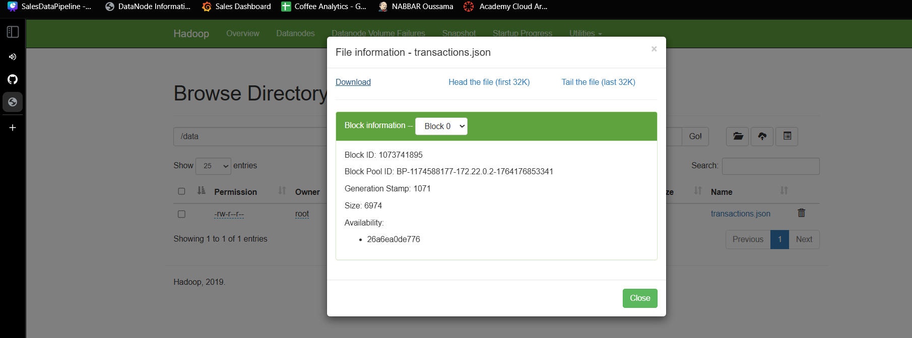
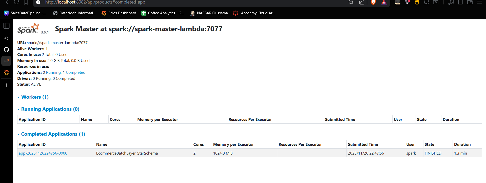
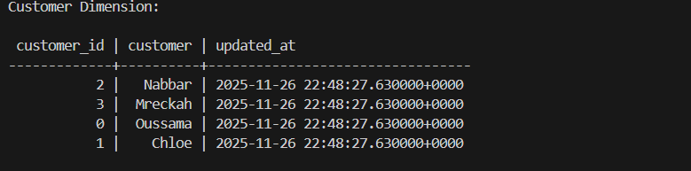
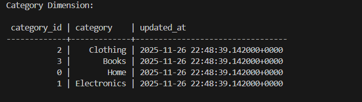
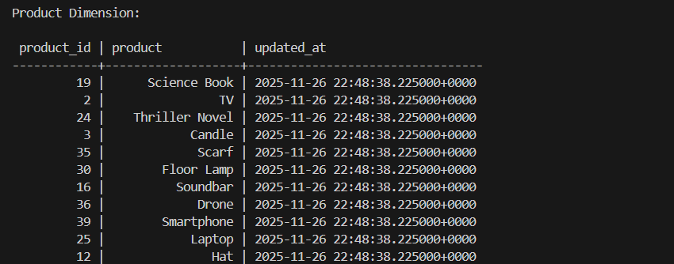
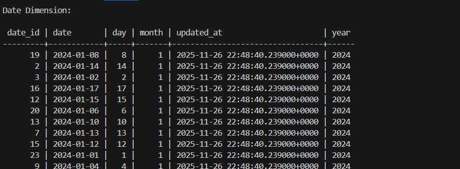
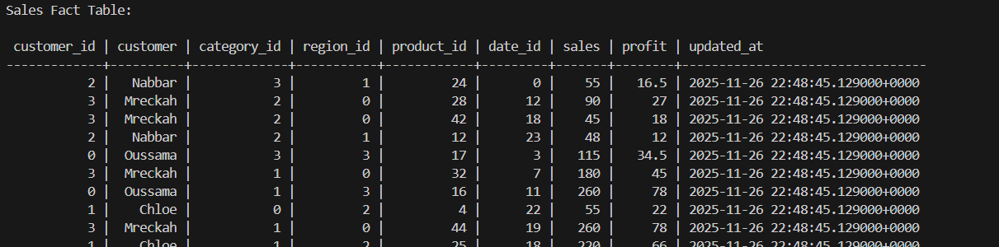
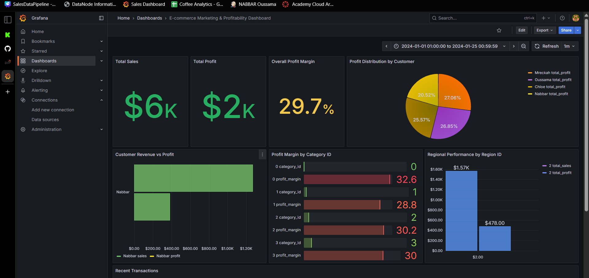

# E-commerce Lambda Architecture - Batch & Serving Layer

## Project Overview
Batch processing system for e-commerce data using Lambda Architecture. Processes historical data for business intelligence.

## Architecture

## Documentation Sections

### HDFS - Data Storage

### Spark - Batch Processing

### Cassandra - Data Storage

### Grafana - Analytics Dashboard

## Batch Processing Results

### Key Business Metrics
- **Total Sales**: $6,305.00
- **Total Profit**: $1,869.60
- **Total Orders**: 46
- **Profit Margin**: 29.65%

## Access Points
- **Grafana**: http://localhost:3000
- **Spark UI**: http://localhost:8082
- **HDFS**: http://localhost:9870